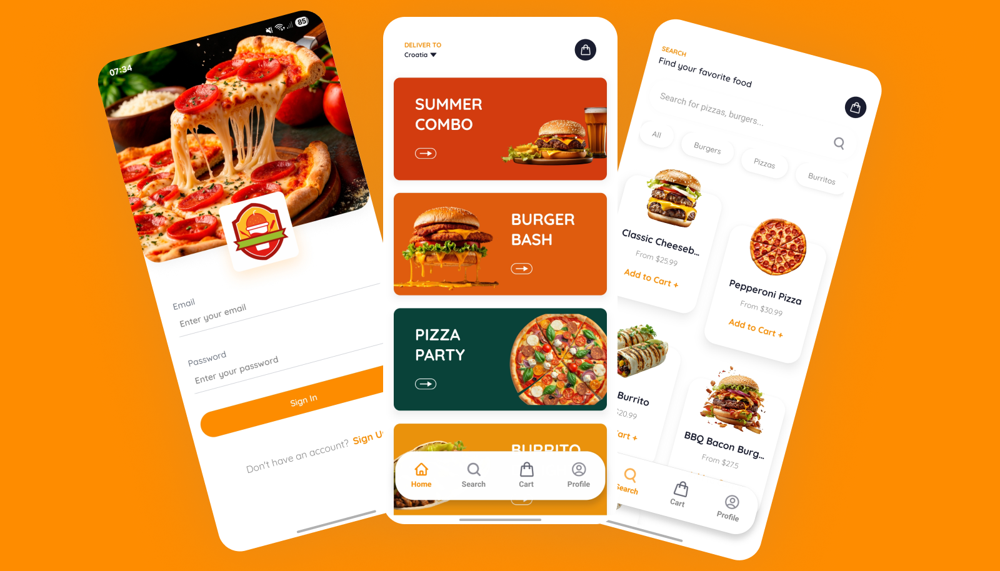
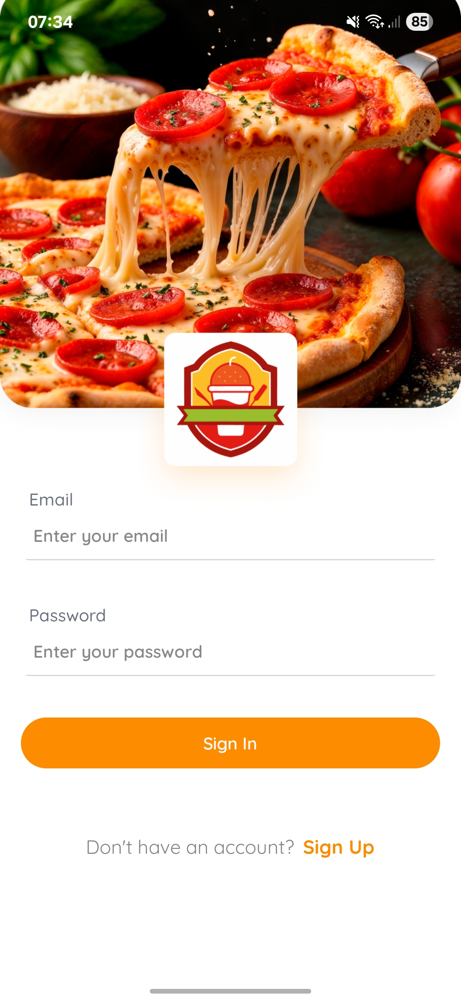
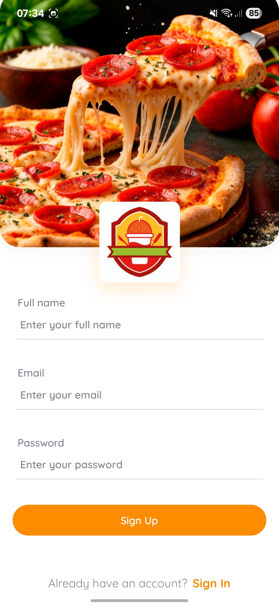
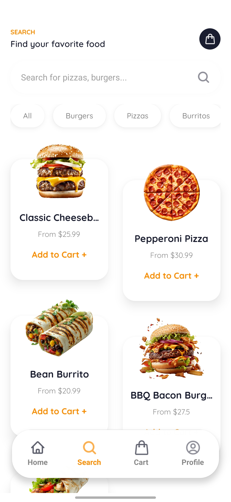
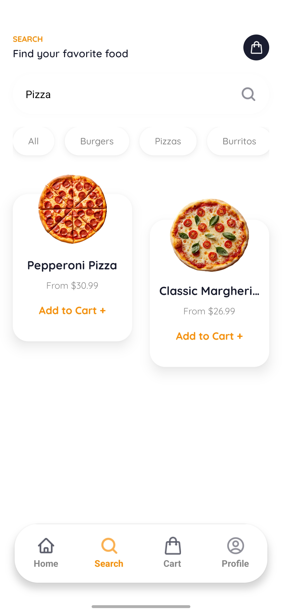
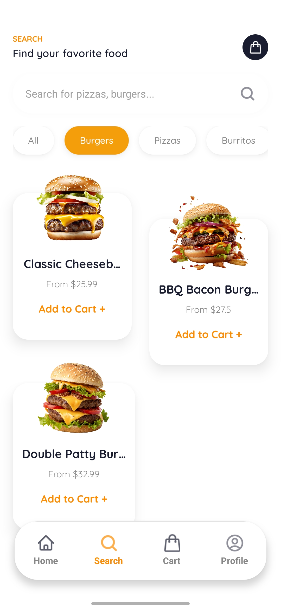
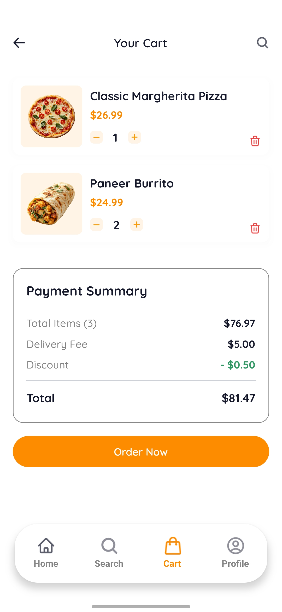

# 🍔 Fast Food App - Aplicativo de Delivery Mobile

<p align="center">
  
</p>

## 📱 Sobre o Projeto

O Fast Food App é uma aplicação mobile completa para delivery de comida, desenvolvida com **React Native e Expo**. O aplicativo oferece uma experiência de usuário fluida e intuitiva, permitindo que os usuários naveguem pelo cardápio, personalizem seus pedidos, gerenciem seu carrinho de compras e realizem pedidos de forma rápida e eficiente.

## 🛠️ Tecnologias Utilizadas

### Frontend
- **TypeScript**: Tipagem estática para código mais seguro
- **React Native**: Framework para desenvolvimento mobile
- **Expo**: Plataforma para desenvolvimento React Native
- **NativeWind/TailwindCSS**: Estilização moderna e responsiva
- **Expo Router**: Sistema de navegação baseado em arquivos
- **Zustand**: Gerenciamento de estado global

### Backend e Autenticação
- **Appwrite**: Backend-as-a-Service para autenticação e banco de dados


## ✨ Funcionalidades

### Autenticação de Usuários
- Sistema completo de cadastro e login
- Gerenciamento de sessão com Appwrite
- Perfil de usuário personalizado

### Navegação e Descoberta
- Pesquisa de itens do cardápio
- Filtragem por categorias
- Interface de usuário intuitiva e responsiva

### Gerenciamento de Pedidos
- Adição de itens ao carrinho
- Personalização de pedidos
- Cálculo automático de preços

### Perfil e Configurações
- Visualização de informações do usuário
- Logout seguro

## 📸 Screenshots

<!-- Substitua os comentários abaixo por screenshots reais do seu aplicativo -->

### Tela de Login e Cadastro
<p align="center">
  
  
</p>

### Home e Pesquisa
<p align="center">
  
  
  
</p>

### Carrinho e Perfil
<p align="center">
  
  
</p>

## 🚀 Como Executar o Projeto

### Pré-requisitos

- Node.js (versão 16 ou superior)
- npm ou yarn
- Expo CLI
- Conta no Appwrite (para backend)

### Instalação

1. Clone o repositório
   ```bash
   git clone https://github.com/seu-usuario/fast-food-app.git
   cd fast-food-app
   ```

2. Instale as dependências
   ```bash
   npm install
   # ou
   yarn install
   ```

3. Configure as variáveis de ambiente
   - Crie um arquivo `.env` na raiz do projeto
   - Adicione suas credenciais do Appwrite:
   ```
   EXPO_PUBLIC_APPWRITE_ENDPOINT=seu-endpoint
   EXPO_PUBLIC_APPWRITE_PROJECT_ID=seu-project-id
   ```

4. Inicie o aplicativo
   ```bash
   npx expo start
   ```

## 📬 Contato

Seu Nome - [matheusz.nied@gmail.com](mailto:matheusz.nied@gmail.com)

Link do Projeto: [https://github.com/kaizen/fast-food-app](https://github.com/kaizen/fast-food-app)

---

<p align="center">Desenvolvido com ❤️ e ☕</p>
